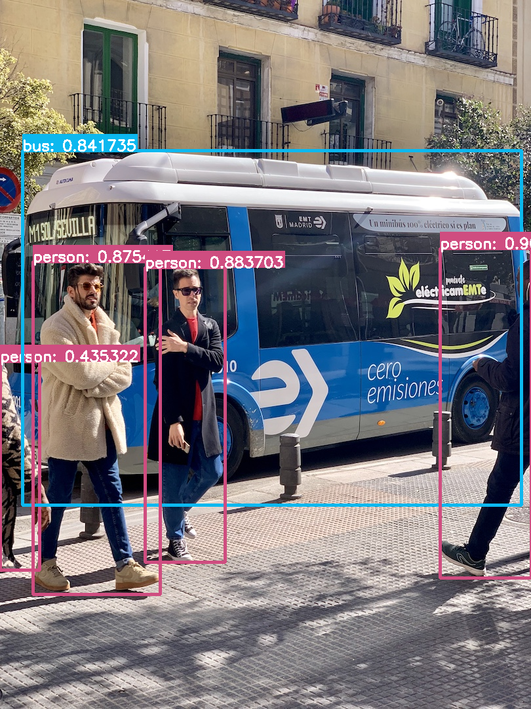
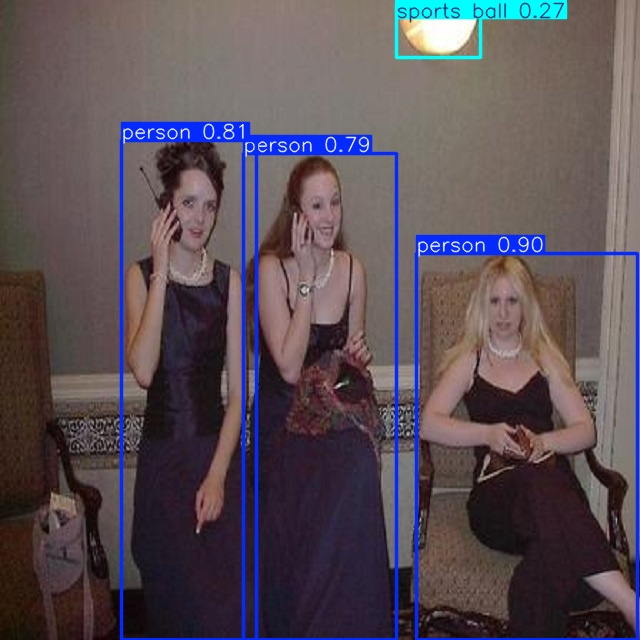
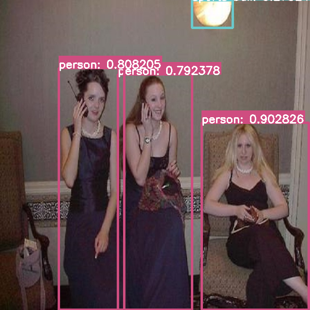

# TensorRT-Alpha-Plus🔥

TensorRT for Web-RTDETR、Web-YOLOv8、RTDETR、YOLOv8、YOLOv8-Pose、YOLOv8-Seg、YOLOv8-Cls、YOLOv7、YOLOv6、YOLOv5......

# 功能

> 1. 通过 TensorRT 部署：支持主流的目标检测模型🔥
> 2. 提供 RTDETR 和 YOLOv8 的 WebAPI，可快速集成到工业环境🔥
> 3. WebAPI 使用 CPP 的 Crow 框架
> 4. Json 处理使用 nlohmann 的 JSON for Modern C++


# 待实现

> 1. 集成 YOLOv10 和 YOLO11 并提供 WebAPI
> 2. WebAPI 提供视频的输入格式


# 实测

环境：NVIDIA GeForce RTX 3090

RTDETR-L.pt 【VS】 RTDETR-L.trt

|          | Pytorch+Python | TensorRT+CPP                            |
| -------- | -------------- | --------------------------------------- |
| 输入     | 1280x1280      | 1280x1280                               |
| 推理速度 | 1s~3s/张       | 0.5-1s/张                               |
| GPU 占用 | 5676 MiB       | 未使用状态：260 MiB，使用状态：1866 MiB |


**关于精度的问题：** 几乎一致，COCO数据集推理：

<table>
    <tr>
        <td>
            <center>图1  RTDETR-L.pt </center>
        </td>
        <td >
            <center>图2 YOLOv8.trt</center>
        </td>
        <td >
            <center>图3 RTDETR-L.trt</center>
        </td>
    </tr>
</table>


私有数据集推理：

<table>
    <tr>
        <td>
            <center>图1  RTDETR-L.pt </center>
        </td>
        <td >
            <center>图2 RTDETR-L.trt</center>
        </td>
    </tr>
</table>


YOLOV8n 【VS】 YOLOv8.trt

|          | Pytorch+Python | TensorRT+CPP            |
| -------- | -------------- | ----------------------- |
| 输入     | 640x640        | 640x640                 |
| 推理速度 | 10-15ms        | 1.5-2 ms（提升 5-8 倍） |
| GPU 占用 | 1946MiB        | 296MiB（降低 6 倍左右） |

**关于精度的问题：** 几乎一致，COCO数据集推理：

<table>
    <tr>
        <td ><center>图1  YOLOV8.pt </center></td>
        <td ><center>图2 YOLOV8.trt</center></td>
    </tr>
</table>


# 上手指南


## 环境

测试环境：NVIDIA GeForce RTX 3090

```bash
python 3.8
ultralytics: 8.2.64
torch: 1.13.1+cu116
TensorRT: 8.6.1.6
```


**安装：ultralytics**

```bash
conda create -n [name] python=3.8
conda activate [name]
pip install ultralytics==8.2.64
```


**安装 cuda 与 cudnn**

Cuda 版本查看，Linux 与 Windows 均可使用以下命令

```bash
nvcc -V

nvcc: NVIDIA (R) Cuda compiler driver
Copyright (c) 2005-2022 NVIDIA Corporation
Built on Tue_May__3_18:49:52_PDT_2022
Cuda compilation tools, release 11.7, V11.7.64
Build cuda_11.7.r11.7/compiler.31294372_0
```

下面的包根据个人的显卡安装对应版本：https://pytorch.org/get-started/locally

```bash
pip install torch==1.13.1+cu116 torchvision==0.14.1+cu116 torchaudio==0.13.1
```

**安装对应自己 Cuda 版本的 TensorRT**（不能超过 Cuda 版本）

- 官方下载（需要注册登录）：https://developer.nvidia.com/tensorrt/download

选择 tar 类型的安装包，例如：[TensorRT 8.6 GA for Linux x86_64 and CUDA 11.0, 11.1, 11.2, 11.3, 11.4, 11.5, 11.6, 11.7 and 11.8 TAR Package](https://developer.nvidia.com/downloads/compute/machine-learning/tensorrt/secure/8.6.1/tars/TensorRT-8.6.1.6.Linux.x86_64-gnu.cuda-11.8.tar.gz)

```shell
# 复制下载链接用命令下载
wget https://developer.nvidia.com/downloads/compute/machine-learning/tensorrt/secure/8.6.1/tars/TensorRT-8.6.1.6.Linux.x86_64-gnu.cuda-11.8.tar.gz
# 解压
tar -xzvf TensorRT-8.6.1.6.Linux.x86_64-gnu.cuda-11.8.tar.gz
cd /data02/xs/app/TensorRT-8.6.1.6

# 查看当前的shell终端
echo $SHELL
/bin/zshrc

vim ~/.zshrc
export LD_LIBRARY_PATH=$LD_LIBRARY_PATH:/data02/xs/app/TensorRT-8.6.1.6/lib
export C_INCLUDE_PATH=$C_INCLUDE_PATH:/data02/xs/app/TensorRT-8.6.1.6/include
export CPLUS_INCLUDE_PATH=$CPLUS_INCLUDE_PATH:/data02/xs/app/TensorRT-8.6.1.6/include
source ~/.zshrc
 
# 编译 TensorRT
cd /data02/xs/app/TensorRT-8.6.1.6/samples/sampleOnnxMNIST
sudo make

# 测试 TensorRT 是否可行
cd /data02/xs/app/TensorRT-8.6.1.6/bin
./sample_onnx_mnist
```


## 工具

必备工具安装：

```shell
sudo apt-get update 
sudo apt-get install build-essential 
sudo apt-get install git
sudo apt-get install gdb
sudo apt-get install cmake
sudo apt-get install pkg-config libgtk-3-dev libavcodec-dev libavformat-dev libswscale-dev libv4l-dev libxvidcore-dev libx264-dev 
sudo apt-get install libopencv-dev
# 查看 opencv 版本
pkg-config --modversion opencv
```

**安装 Crow**

需要先安装 Asio：

```bash
# 下载最新版本的 Asio
wget https://github.com/chriskohlhoff/asio/archive/refs/tags/asio-1-24-0.tar.gz
# 解压下载的 tar 文件
tar -xvzf asio-1-24-0.tar.gz
# 进入解压后的目录
cd asio-asio-1-24-0/asio
# 编译安装
./autogen.sh
./configure
make
sudo make install

# 检查 Asio 是否安装成功
$ ls /usr/local/include/asio.hpp
/usr/local/include/asio.hpp
```

**安装 Crow**

```bash
git clone https://github.com/CrowCpp/Crow.git
mkdir build
cd build
cmake .. -DCROW_BUILD_EXAMPLES=OFF -DCROW_BUILD_TESTS=OFF
sudo make install
```

Demo.cpp 测试 Crow 是否可用：

```cpp
#include "crow.h"

int main()
{
    crow::SimpleApp app;

    CROW_ROUTE(app, "/")
    ([]() {
        return "Hello, world!";
    });

    app.port(8888).run();
}
```


## 配置

下载 TensorRT-Alpha-Plus 项目

```shell
git clone https://github.com/xstongxue/TensorRT-Alpha-Plus
```

配置 TensorRT-Alpha-Plus

```bash
cd tensorrt-alpha/cmake
vim common.cmake

# 检查环境变量（适用于已配置 TensorRT 环境的情况）
# 如果 TensorRT 已正确安装并配置，可以查看环境变量以确定安装目录：
echo $LD_LIBRARY_PATH

# 把common.cmake文件第20行中的TensorRT_ROOT修改成您的TensorRT安装目录, 例如改成如下:
set(TensorRT_ROOT /data02/xs/app/TensorRT-8.6.1.6/)
```


## 导出

常用模型的权重下载（待上传）：

| model | 夸克网盘 |
| ----- | -------- |
|       |          |
|       |          |
|       |          |


**模型导出：pt -> onnx -> trt/engine**

导出的 trt 模型放入目录：`/data02/xs/code/tensorrt-alpha/weights`

### RTDETR 模型导出

```shell
# 在自己的python虚拟环境下安装TensorRT（对应自己的python版本）
conda activate [name]
cd /data02/xs/app/TensorRT-8.6.1.6/python
python3 -m pip install tensorrt-8.6.1-cp38-none-linux_x86_64.whl

# export onnx
yolo mode=export model=rtdetr-l.pt format=onnx dynamic=True opset=16 imgsz=640,640

# 导出为 trt/engine, 自己更改路径
CUDA_VISIBLE_DEVICES=1 /data02/xs/app/TensorRT-8.6.1.6/bin/trtexec \
  --onnx=rtdetr-l.onnx \
  --saveEngine=rtdetr-l.trt \
  --buildOnly \
  --minShapes=images:1x3x640x640 \
  --optShapes=images:2x3x640x640 \
  --maxShapes=images:4x3x640x640
```

- 参数：half=True 和 dynamic=True 不能同时使用


### YOLO 模型导出

```shell
# 在自己的python虚拟环境下安装TensorRT（对应自己的python版本）
cond activate [name]
cd /data02/xs/app/TensorRT-8.6.1.6/python
python3 -m pip install tensorrt-8.6.1-cp38-none-linux_x86_64.whl

# export onnx
yolo mode=export model=yolov8n.pt format=onnx dynamic=True opset=12 

# 导出为 trt,自己更改路径
CUDA_VISIBLE_DEVICES=1 /data02/xs/app/TensorRT-8.6.1.6/bin/trtexec  --onnx=/data02/xs/code/tensorrt-alpha/yolov8n.onnx  --saveEngine=/data02/xs/code/tensorrt-alpha/yolov8n.trt  --buildOnly --minShapes=images:1x3x640x640 --optShapes=images:2x3x640x640 --maxShapes=images:4x3x640x640

# 导出为 engine,自己更改路径
/data02/xs/app/TensorRT-8.6.1.6/bin/trtexec  --onnx=/data02/xs/code/ultralytics/weights/yolov8n.onnx  --saveEngine=/data02/xs/code/ultralytics/weights/yolov8n.engine  --buildOnly --minShapes=images:1x3x640x640 --optShapes=images:2x3x640x640 --maxShapes=images:4x3x640x640
```


## 运行

### RTDETR 模型运行

#### **非 Web 版**

编译

```bash
cd /data02/xs/code/tensorrt-alpha-plus/rtdetr
mkdir build
cd build
cmake ..
make -j10
```

运行推理

```bash
CUDA_VISIBLE_DEVICES=1 ./app_rtdetr
```


#### **Web 版**

```bash
cd /data02/xs/code/tensorrt-alpha-plus/webapi_rtdetr
mkdir build
cd build
# 编译
bash cmake_web_rtdetr.sh
# 运行
bash run_web_rtdetr.sh
# 终止
bash kill_web_rtdetr.sh
```

参数的设置，打开 run_web_rtdetr.sh

```cmake
model_path="../../weights/rtdetr.trt"
device=1  # 指定设备
port=8890 # 端口号
```

前端传入参数指定：

```html
img: file  # 上传检测的图像
is_save："false" / "true"  # 默认 "false"
is_show："false" / "true"  # 默认 "false"
```


### YOLOV8 模型运行

#### **非 Web 版**

编译

```bash
cd /data02/xs/code/tensorrt-alpha/yolov8
mkdir build
cd build
cmake ..
make -j10
```

运行推理

```bash
./app_yolov8  --model=/data02/xs/code/tensorrt-alpha/yolov8n.trt --size=640 --batch_size=1  --img=/data02/xs/code/tensorrt-alpha/data/bus.jpg
```

#### **Web 版**

编译

```shell
cd /data02/xs/code/tensorrt-alpha/yolov8
mkdir build
cd build
cmake ..
make -j10
```

运行

```bash
./infer_yolov8
```

前端传入参数指定：

```html
img: file  # 上传检测的图像
is_save："false" / "true"  # 默认 "false"
model_path："../../weights/yolov8n.trt"  # 默认 "../../weights/yolov8n.trt"
```


## 致谢

感谢他们伟大的工作！

- https://github.com/ultralytics/ultralytics
- https://github.com/FeiYull/tensorrt-alpha
- https://github.com/CrowCpp/Crow
- https://github.com/nlohmann/json


## Citation

```
@misc{xstongxue_TensorRT-Alpha-Plus,  
  author = {xstongxue},  
  title = {TensorRT-Alpha-Plus},  
  year = {2024},  
  publisher = {GitHub},  
  journal = {GitHub repository},  
  howpublished = {https://github.com/xstongxue/TensorRT-Alpha-Plus}
}
```